# Simple and Exact Solutions to Position Calculation

This vignette contains solutions to various geographical position
calculations. It is inspired and follows the 10 examples given at
<https://www.navlab.net/nvector/> .

Most of the content is based on ([Gade 2010](#ref-gade2010)).

The color scheme in the Figures is as follows:

- \\\mathbf{\color{red}{Red}}\\: Given
- \\\mathbf{\color{green}{Green}}\\: Find this

### Example 1: A and B to delta

Given two positions \\A\\ and \\B\\, find the exact vector from \\A\\ to
\\B\\ in meters north, east and down, and find the direction
(azimuth/bearing) to \\B\\, relative to north. Use WGS-84 ellipsoid.

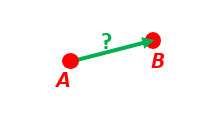

Figure 1: A and B to delta.

#### Solution

Transform the positions \\A\\ and \\B\\ to (decimal) degrees and depths:

``` r
# Position A:
lat_EA <- rad(1)
lon_EA <- rad(2)
z_EA <- 3

# Position B:
lat_EB <- rad(4)
lon_EB <- rad(5)
z_EB <- 6
```

**Step 1**: Convert to n-vectors, \\\mathbf{n}\_{EA}^E\\ and
\\\mathbf{n}\_{EB}^E\\

``` r
(n_EA_E <- lat_lon2n_E(lat_EA, lon_EA))
#> [1] 0.99923861 0.03489418 0.01745241
(n_EB_E <- lat_lon2n_E(lat_EB, lon_EB))
#> [1] 0.99376802 0.08694344 0.06975647
```

**Step 2**: Find \\\mathbf{p}\_{AB}^E\\ (delta decomposed in E). WGS-84
ellipsoid is default

``` r
(p_AB_E <-  n_EA_E_and_n_EB_E2p_AB_E(n_EA_E, n_EB_E, z_EA, z_EB))
#> [1] -34798.44 331985.66 331375.96
```

**Step 3**: Find \\\mathbf{R}\_{EN}\\ for position \\A\\

``` r
(R_EN <- n_E2R_EN(n_EA_E))
#>               [,1]       [,2]        [,3]
#> [1,] -0.0174417749 -0.0348995 -0.99923861
#> [2,] -0.0006090802  0.9993908 -0.03489418
#> [3,]  0.9998476952  0.0000000 -0.01745241
```

**Step 4**: Find \\\mathbf{p}\_{AB}^N = \mathbf{R}\_{NE}
\mathbf{p}\_{AB}^E\\

``` r
# (Note the transpose of R_EN: The "closest-rule" says that when
# decomposing, the frame in the subscript of the rotation matrix that is
# closest to the vector, should equal the frame where the vector is
# decomposed. Thus the calculation R_NE*p_AB_E is correct, since the vector
# is decomposed in E, and E is closest to the vector. In the above example
# we only had R_EN, and thus we must transpose it: base::t(R_EN) = R_NE)
(p_AB_N <- base::t(R_EN) %*% p_AB_E %>%  
  as.vector())
#> [1] 331730.23 332997.87  17404.27
```

The vector \\\mathbf{p}\_{AB}^N\\ connects A to B in the North-East-Down
framework. The line-of-sight distance, in meters, from A to B is

``` r
(los_distance <- norm(p_AB_N, type = "2"))
#> [1] 470356.7
```

while the
[altitude](https://en.wikipedia.org/wiki/Horizontal_coordinate_system)
(elevation above the horizon), in decimal degrees, is

``` r
(elevation <- atan2(-p_AB_N[3], p_AB_N[2]) %>% deg())
#> [1] -2.991865
```

**Step 5**: Also find the direction to \\B\\
([azimuth](https://en.wikipedia.org/wiki/Azimuth)), in decimal degrees,
relative to true North

``` r
(azimuth <- atan2(p_AB_N[2], p_AB_N[1]) %>%   # positive angle about down-axis
  deg())
#> [1] 45.10926
```

### Example 2: B and delta to C

A radar or sonar attached to a vehicle \\B\\ (**B**ody coordinate frame)
measures the distance and direction to an object \\C\\.

We assume that the distance and two angles (typically bearing and
elevation relative to \\B\\) are already combined to the vector
\\\mathbf{p}\_{BC}^B\\ (i.e. the vector from \\B\\ to \\C\\, decomposed
in B).

The position of \\B\\ is given as \\\mathbf{n}\_{EB}^E\\ and
\\z\_{EB}\\, and the orientation (attitude) of \\B\\ is given as
\\\mathbf{R}\_{NB}\\ (this rotation matrix can be found from
roll/pitch/yaw by using `zyx2R`).

Find the exact position of object \\C\\ as n-vector and depth
(\\\mathbf{n}\_{EC}^E\\ and \\z\_{EC}\\), assuming Earth ellipsoid with
semi-major axis \\a\\ and flattening \\f\\.

For WGS-72, use \\a = 6378135~\mathrm{m}\\ and \\f =
\dfrac{1}{298.26}\\.

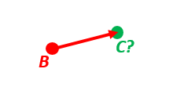

Figure 2: B and delta to C.

#### Solution

``` r
p_BC_B <- c(3000, 2000, 100)

# Position and orientation of B is given:
(n_EB_E <- unit(c(1, 2, 3))) # unit() to get unit length of vector
#> [1] 0.2672612 0.5345225 0.8017837
z_EB <- -400
(R_NB <- zyx2R(rad(10),rad(20),rad(30))) # the three angles are yaw, pitch, and roll
#>            [,1]       [,2]       [,3]
#> [1,]  0.9254166 0.01802831  0.3785223
#> [2,]  0.1631759 0.88256412 -0.4409696
#> [3,] -0.3420201 0.46984631  0.8137977

# A custom reference ellipsoid is given (replacing WGS-84):
# (WGS-72)
a <- 6378135
f <- 1 / 298.26 
```

**Step 1**: Find \\\mathbf{R}\_{EN}\\

``` r
(R_EN <- n_E2R_EN(n_EB_E))
#>            [,1]       [,2]       [,3]
#> [1,] -0.3585686 -0.8944272 -0.2672612
#> [2,] -0.7171372  0.4472136 -0.5345225
#> [3,]  0.5976143  0.0000000 -0.8017837
```

**Step 2**: Find \\\mathbf{R}\_{EB}\\ from \\\mathbf{R}\_{EN}\\ and
\\\mathbf{R}\_{NB}\\

``` r
(R_EB <- R_EN %*% R_NB) # Note: closest frames cancel
#>            [,1]       [,2]        [,3]
#> [1,] -0.3863656 -0.9214254  0.04119242
#> [2,] -0.4078587  0.1306225 -0.90365318
#> [3,]  0.8272684 -0.3659411 -0.42627939
```

**Step 3**: Decompose the delta vector \\\mathbf{p}\_{BC}^B\\ in E

``` r
(p_BC_E <- R_EB %*% p_BC_B) # no transpose of R_EB, since the vector is in B)
#>           [,1]
#> [1,] -2997.828
#> [2,] -1052.696
#> [3,]  1707.295
```

**Step 4**: Find the position of \\C\\, using the functions that goes
from one position and a delta, to a new position

``` r
l <- n_EA_E_and_p_AB_E2n_EB_E(n_EB_E, p_BC_E, z_EB, a, f)
(n_EB_E <- l[['n_EB_E']])
#> [1] 0.2667916 0.5343565 0.8020507
(z_EB <- l[['z_EB']])
#> [1] -406.0072
```

Convert to latitude and longitude, and height

``` r
lat_lon_EB <- n_E2lat_lon(n_EB_E)
(latitude  <- lat_lon_EB[1])
#> [1] 0.9307209
(longitude <- lat_lon_EB[2])
#> [1] 1.107728

# height (= - depth)
(height <- -z_EB)
#> [1] 406.0072
```

### Example 3: ECEF-vector to geodetic latitude

Position \\B\\ is given as an “ECEF-vector” \\\mathbf{p}\_{EB}^E\\
(i.e. a vector from E, the center of the Earth, to \\B\\, decomposed in
E).

Find the geodetic latitude, longitude and height (`latEB`, `lonEB` and
`hEB`), assuming WGS-84 ellipsoid.

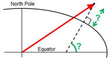

Figure 3: ECEF-vector to geodetic latitude.

Position \\B\\ is given as \\\mathbf{p}\_{EB}^E\\, i.e. “ECEF-vector”

``` r
(p_EB_E <- 6371e3 * c(0.9, -1, 1.1)) # m
#> [1]  5733900 -6371000  7008100
```

#### Solution

Find n-vector from the p-vector

``` r
l <- p_EB_E2n_EB_E(p_EB_E)
(n_EB_E <- l[['n_EB_E']])
#> [1]  0.5170890 -0.5745433  0.6344439
(z_EB <- l[['z_EB']])
#> [1] -4702060
```

Convert to latitude and longitude, and height

``` r
lat_lon_EB <- n_E2lat_lon(n_EB_E)
(latEB  <- lat_lon_EB[1])
#> [1] 0.6872888
(lonEB <- lat_lon_EB[2])
#> [1] -0.8379812

# height (= - depth)
(hEB <- -z_EB)
#> [1] 4702060
```

### Example 4: Geodetic latitude to ECEF-vector

Find the ECEF-vector \\\mathbf{p}\_{EB}^E\\ for the geodetic position
\\B\\ given as latitude \\lat\_{EB}\\, longitude \\lon\_{EB}\\ and
height \\h\_{EB}\\.

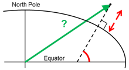

Figure 4: Geodetic latitude to ECEF-vector.

#### Solution

``` r
lat_EB <- rad(1)
lon_EB <- rad(2)
h_EB <- 3
```

**Step 1**: Convert to n-vector

``` r
(n_EB_E <- lat_lon2n_E(lat_EB, lon_EB))
#> [1] 0.99923861 0.03489418 0.01745241
```

**Step 2**: Find the ECEF-vector p_EB_E

``` r
(p_EB_E <- n_EB_E2p_EB_E(n_EB_E, -h_EB))
#> [1] 6373290.3  222560.2  110568.8
```

### Example 5: Surface distance

Given two positions \\A\\ \\\mathbf{n}\_{EA}^E\\ and \\B\\
\\\mathbf{n}\_{EB}^E\\, find the surface distance \\s\_{AB}\\
(i.e. great circle distance). The heights of \\A\\ and \\B\\ are not
relevant (i.e. if they don’t have zero height, we seek the distance
between the points that are at the surface of the Earth, directly
above/below \\A\\ and \\B\\). Also find the Euclidean distance (chord
length) \\d\_{AB}\\ using nonzero heights.

Assume a spherical model of the Earth with radius \\r\_{Earth} =
6371~\mathrm{km}\\.

Compare the results with exact calculations for the WGS-84 ellipsoid.

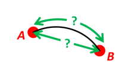

Figure 5: Surface distance.

#### Solution

``` r
n_EA_E <- lat_lon2n_E(rad(88), rad(0));
n_EB_E <- lat_lon2n_E(rad(89), rad(-170))
r_Earth <- 6371e3
```

##### Spherical model

The great circle distance is given by equations (16) in ([Gade
2010](#ref-gade2010)) (the \\\arccos\\ is ill conditioned for small
angles; the \\\arcsin\\ is ill-conditioned for angles near \\\pi/2\\,
and not valid for angles greater than \\\pi/2\\) where \\r\_{roc}\\ is
the radius of curvature, i.e. Earth radius + height:

\\\begin{align} s\_{AB} & = r\_{roc} \cdot \arccos
\\\big(\mathbf{n}\_{EA}^E \boldsymbol{\cdot} \mathbf{n}\_{EB}^E\big)\\ &
= r\_{roc} \cdot \arcsin \\\big(\big\|\mathbf{n}\_{EA}^E
\boldsymbol{\times} \mathbf{n}\_{EB}^E\big\|\big) \tag{16} \end{align}\\

The formulation via \\\operatorname{atan2}\\ of equation (6) in ([Gade
2010](#ref-gade2010)) is instead well conditioned for all angles:

\\s\_{AB} = r\_{roc} \cdot
\operatorname{atan2}\big(\big\|\mathbf{n}\_{EA}^E \boldsymbol{\times}
\mathbf{n}\_{EB}^E\big\|, \mathbf{n}\_{EA}^E \boldsymbol{\cdot}
\mathbf{n}\_{EB}^E\big) \tag{6}\\

``` r
(s_AB <- (atan2(base::norm(pracma::cross(n_EA_E, n_EB_E), type = "2"),
                pracma::dot(n_EA_E, n_EB_E)) * r_Earth))
#> [1] 332456.4
```

The Euclidean distance is given by

\\d = r\_{roc} \cdot \big\| \mathbf{n}\_{EB}^E - \mathbf{n}\_{EA}^E
\big\|\\

``` r
(d_AB <- base::norm(n_EB_E - n_EA_E, type = "2") * r_Earth)
#> [1] 332418.7
```

##### Elliptical model (WGS-84 ellipsoid)

The distance between \\A\\ and \\B\\ ca be calculated via `geosphere`
package

``` r
geosphere::distGeo(c(0, 88), c(-170, 89))
#> [1] 333947.5
```

### Example 6: Interpolated position

Given the position of \\B\\ at time \\t_0\\ and \\t_1\\,
\\\mathbf{n}\_{EB}^E(t_0)\\ and \\\mathbf{n}\_{EB}^E(t_1)\\.

Find an interpolated position at time \\t_i\\,
\\\mathbf{n}\_{EB}^E(t_i)\\. All positions are given as n-vectors.

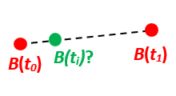

Figure 6: Interpolated position.

#### Solution

Standard interpolation can be used directly with n-vector as

\\ \mathbf{n}\_{EB}^E(t_i) =
\operatorname{unit}\Bigg(\mathbf{n}\_{EB}^E(t_0) + \frac{t_i − t_0}{t_1
− t_0} \Big(\mathbf{n}\_{EB}^E(t_1) − \mathbf{n}\_{EB}^E(t_0)\Big)\Bigg)
\\

``` r
n_EB_E_t0 <- lat_lon2n_E(rad(89.9), rad(-150))
n_EB_E_t1 <- lat_lon2n_E(rad(89.9), rad(150))

# The times are given as:
t0 <- 10
t1 <- 20
ti <- 16 # time of interpolation
```

Using the expression above

``` r
t_frac <- (ti - t0) / (t1 - t0) 
(n_EB_E_ti <- unit(n_EB_E_t0 + t_frac * (n_EB_E_t1 - n_EB_E_t0) ))
#> [1] -0.0015114993  0.0001745329  0.9999988425
```

and converting back to longitude and latitude

``` r
(l  <- n_E2lat_lon(n_EB_E_ti) %>% deg())
#> [1]  89.91282 173.41322
(latitude  <- l[1])
#> [1] 89.91282
(longitude <- l[2])
#> [1] 173.4132
```

### Example 7: Mean position (center/midpoint)

Given three positions \\A\\, \\B\\, and \\C\\ as n-vectors
\\\mathbf{n}\_{EA}^E\\, \\\mathbf{n}\_{EB}^E\\, and
\\\mathbf{n}\_{EC}^E\\, find the mean position, \\M\\, as n-vector
\\\mathbf{n}\_{EM}^E\\.

Note that the calculation is independent of the depths of the positions.


Figure 7: Mean position (center/midpoint).

#### Solution

The (geographical) mean position \\B\_{GM}\\ is simply given equation
(17) in ([Gade 2010](#ref-gade2010)) (assuming spherical Earth)

\\ \mathbf{n}\_{EB\_{GM}}^E = \operatorname{unit}\Big( \sum\_{i = 1}^{m}
\mathbf{n}\_{EB_i}^E \Big) \tag{17} \\

and specifically for the three given points

\\ \mathbf{n}\_{EM}^E = \mathrm{unit}\Big(\mathbf{n}\_{EA}^E +
\mathbf{n}\_{EB}^E + \mathbf{n}\_{EC}^E \Big) =
\frac{\mathbf{n}\_{EA}^E + \mathbf{n}\_{EB}^E + \mathbf{n}\_{EC}^E}{\Big
\| \mathbf{n}\_{EA}^E + \mathbf{n}\_{EB}^E + \mathbf{n}\_{EC}^E \Big\| }
\\ Given the three n-vectors

``` r
n_EA_E <- lat_lon2n_E(rad(90), rad(0))
n_EB_E <- lat_lon2n_E(rad(60), rad(10))
n_EC_E <- lat_lon2n_E(rad(50), rad(-20))
```

find the horizontal mean position

``` r
(n_EM_E <- unit(n_EA_E + n_EB_E + n_EC_E))
#> [1]  0.38411717 -0.04660241  0.92210749
```

and convert to longitude/latitude

``` r
(l  <- n_E2lat_lon(n_EM_E) %>% deg())
#> [1] 67.236153 -6.917511
(latitude  <- l[1])
#> [1] 67.23615
(longitude <- l[2])
#> [1] -6.917511
```

### Example 8: A and azimuth/distance to B

Given a position \\A\\ as n-vector \\\mathbf{n}\_{EA}^E\\, an initial
direction of travel as an azimuth (bearing), \\\alpha\\, relative to
north (clockwise), and finally the distance to travel along a great
circle, \\s\_{AB}\\ find the destination point \\B\\, given as
\\\mathbf{n}\_{EB}^E\\.

Use Earth radius \\r\_{Earth}\\.

In geodesy this is known as “The first geodetic problem” or “The direct
geodetic problem” for a sphere, and we see that this is similar to
[Example 2](#example-02), but now the delta is given as an azimuth and a
great circle distance. (“The second/inverse geodetic problem” for a
sphere is already solved in [Examples 1](#example-01) and
[5](#example-05).)

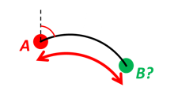

Figure 8: A and azimuth/distance to B.

#### Solution

Given the initial values

``` r
n_EA_E <- lat_lon2n_E(rad(80),rad(-90))
azimuth <- rad(200)
s_AB <- 1000 # distance (m)
r_Earth <- 6371e3 # mean Earth radius (m)
```

**Step 1**: Find unit vectors for north and east as per equations (9)
and (10) in ([Gade 2010](#ref-gade2010))

\$\$ \\\begin{align} \mathbf{k}\_{east}^E & = \begin{bmatrix} 1 \\ 0 \\
0 \end{bmatrix} \times \mathbf{n}^E \tag{9} \\ \mathbf{k}\_{north}^E & =
\mathbf{n}^E \times \begin{bmatrix} 1 \\ 0 \\ 0 \end{bmatrix} \times
\mathbf{n}^E \tag{10} \end{align}\\ \$\$

``` r
k_east_E <- unit(pracma::cross(base::t(R_Ee()) %*% c(1, 0, 0) %>% as.vector(), n_EA_E))
k_north_E <- pracma::cross(n_EA_E, k_east_E)
```

**Step 2**: Find the initial direction vector \\d_E\\

``` r
d_E <- k_north_E * cos(azimuth) + k_east_E * sin(azimuth)
```

**Step 3**: Find \\\mathbf{n}\_{EB}^E\\

``` r
n_EB_E <- n_EA_E * cos(s_AB / r_Earth) + d_E * sin(s_AB / r_Earth)
```

Convert to longitude/latitude

``` r
(l  <- n_E2lat_lon(n_EB_E) %>% deg())
#> [1]  79.99155 -90.01770
(latitude  <- l[1])
#> [1] 79.99155
(longitude <- l[2])
#> [1] -90.0177
```

### Example 9: Intersection of two paths

Define a path from two given positions (at the surface of a spherical
Earth), as the great circle that goes through the two points.

Path A is given by \\A_1\\ and \\A_2\\, while path B is given by \\B_1\\
and \\B_2\\.

Find the position C where the two great circles intersect.

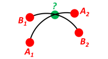

Figure 9: Intersection of two paths.

#### Solution

``` r
n_EA1_E <- lat_lon2n_E(rad(50), rad(180))
n_EA2_E <- lat_lon2n_E(rad(90), rad(180))
n_EB1_E <- lat_lon2n_E(rad(60), rad(160))
n_EB2_E <- lat_lon2n_E(rad(80), rad(-140))

# These are from the python version (results are the same ;-)
# n_EA1_E <- lat_lon2n_E(rad(10), rad(20))
# n_EA2_E <- lat_lon2n_E(rad(30), rad(40))
# n_EB1_E <- lat_lon2n_E(rad(50), rad(60))
# n_EB2_E <- lat_lon2n_E(rad(70), rad(80))
```

Find the intersection between the two paths, \\\mathbf{n}\_{EC}^E\\

``` r
n_EC_E_tmp <- unit(pracma::cross(
  pracma::cross(n_EA1_E, n_EA2_E),
  pracma::cross(n_EB1_E, n_EB2_E)))
```

\\\mathbf{n}\_{{EC}\_{tmp}}^E\\ is one of two solutions, the other is
\\-\mathbf{n}\_{{EC}\_{tmp}}^E\\. Select the one that is closest to
\\\mathbf{n}\_{EA_1}^E\\, by selecting sign from the dot product between
\\\mathbf{n}\_{{EC}\_{tmp}}^E\\ and \\\mathbf{n}\_{EA_1}^E\\

``` r
n_EC_E <- sign(pracma::dot(n_EC_E_tmp, n_EA1_E)) * n_EC_E_tmp
```

Convert to longitude/latitude

``` r
(l  <- n_E2lat_lon(n_EC_E) %>% deg())
#> [1]  74.16345 180.00000
(latitude  <- l[1])
#> [1] 74.16345
(longitude <- l[2])
#> [1] 180
```

### Example 10: Cross track distance (cross track error)

Path A is given by the two positions \\A_1\\ and \\A_2\\ (similar to the
previous example).

Find the cross track distance \\s\_{xt}\\ between the path A (i.e. the
great circle through \\A_1\\ and \\A_2\\) and the position \\B\\
(i.e. the shortest distance at the surface, between the great circle and
\\B\\).

Also find the Euclidean distance \\d\_{xt}\\ between \\B\\ and the plane
defined by the great circle.

Use Earth radius \\6371~\mathrm{km}\\.

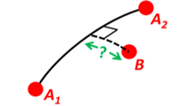

Figure 10: Cross track distance (cross track error).

#### Solution

Given

``` r
n_EA1_E <- lat_lon2n_E(rad(0), rad(0))
n_EA2_E <- lat_lon2n_E(rad(10),rad(0))
n_EB_E  <- lat_lon2n_E(rad(1), rad(0.1))

r_Earth <- 6371e3  # mean Earth radius (m)
```

Find the unit normal to the great circle between n_EA1_E and n_EA2_E as
shown in the Figure [11](#fig:solution-10-fig).

``` r
c_E <- unit(pracma::cross(n_EA1_E, n_EA2_E))
```

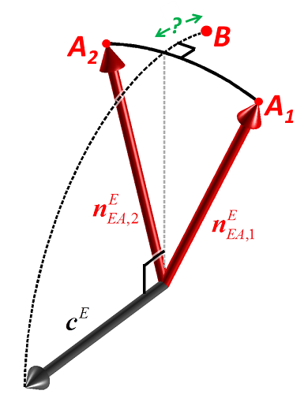

Figure 11: Vectors for cross track distance calculation.

Find the great circle cross track distance

``` r
(s_xt <- (acos(pracma::dot(c_E, n_EB_E)) - pi / 2) * r_Earth)
#> [1] 11117.8
```

Find the Euclidean cross track distance

``` r
(d_xt <- -pracma::dot(c_E, n_EB_E) * r_Earth)
#> [1] 11117.79
```

### Example 11: Cross track intersection

Path A is given by the two positions \\A_1\\ and \\A_2\\ (similar to the
previous example).

Find the cross track intersection point \\C\\ between the path A
(i.e. the great circle through \\A_1\\ and \\A_2\\) and the position
\\B\\, i.e. the shortest distance point at the surface, between the
great circle and \\B\\.

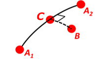

Figure 12: Cross track intersection.

#### Solution

Given (note that \\B\\ doesn’t necessarily need to lie in between
\\A_1\\ and \\A_2\\ as per Figure above)

``` r
n_EA1_E <- lat_lon2n_E(rad(0), rad(3))
n_EA2_E <- lat_lon2n_E(rad(0),rad(10))
n_EB_E  <- lat_lon2n_E(rad(-1), rad(-1))
```

Find the normal to the great circle between n_EA1_E and n_EA2_E:

``` r
n_EN_E <- unit(pracma::cross(n_EA1_E, n_EA2_E))
```

Find the intersection points (one antipodal to the other):

``` r
n_EC_E_tmp <- unit(
  pracma::cross(
    n_EN_E,
    pracma::cross(n_EN_E, n_EB_E)
  )
)
```

Choose the one closest to B:

``` r
n_EC_E <- sign(pracma::dot(n_EC_E_tmp, n_EB_E)) * n_EC_E_tmp
```

Convert to longitude/latitude

``` r
(l  <- n_E2lat_lon(n_EC_E) %>% deg())
#> [1]  0 -1
(latitude  <- l[1])
#> [1] 0
(longitude <- l[2])
#> [1] -1
```

## References

Gade, Kenneth. 2010. “A Nonsingular Horizontal Position Representation.”
*The Journal of Navigation* 63 (3): 395–417.
<https://www.navlab.net/Publications/A_Nonsingular_Horizontal_Position_Representation.pdf>.
