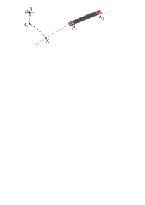

# Calculate cross-track intersection

Calculate the cross-track intersection between the position of a body
(i.e. an aircraft) and a great circle arc as defined by two points (i.e.
the runway's thresholds).

## Usage

``` r
cross_track_intersection(b, a1, a2)
```

## Arguments

- b:

  coordinates of the body, b: a vector of longitude, latitude (in
  decimal degrees) and altitude (in meters) in WGS84

- a1:

  first coordinate of a great circle arc: a vector of longitude,
  latitude (in decimal degrees) and elevation (in meters) in WGS84

- a2:

  second coordinate of a great circle arc: a vector of longitude,
  latitude (in decimal degrees) and elevation (in meters) in WGS84

## Value

a WGS84 vector with longitude and latitude (decimal degrees)

## Details

The cross-track intersection between the position of a body, B, (i.e. an
aircraft) and a great circle arc as defined by two points, A1 and A2,
(i.e. the runway's thresholds) is the intersection, X, of the above arc
with the great circle arc passing through the ground projection of B, G,
and perpendicular to A1-A2.



## See also

Other utilities:
[`along_track_distance()`](https://nvctr.ansperformance.eu/reference/along_track_distance.md),
[`altitude_azimuth_distance()`](https://nvctr.ansperformance.eu/reference/altitude_azimuth_distance.md),
[`cross_track_distance()`](https://nvctr.ansperformance.eu/reference/cross_track_distance.md)

## Examples

``` r
if (FALSE) { # \dontrun{
# aircraft (longitude, latitude, altitude)
b <- c(8.086135, 49.973942, 6401)
# EDDF: 07R (longitude, latitude, altitude)
a1 <- c(8.53417, 50.0275, 328)
# EDDF: 25L
a2 <- c(8.58653, 50.0401, 362)
cross_track_intersection(b, a1, a2)
} # }
```
