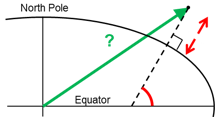
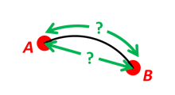
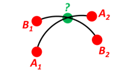
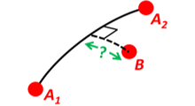

```{r setup, include = FALSE}
knitr::opts_chunk$set(
  collapse = TRUE,
  comment = "#>"
)

library(png)
library(nvctr)
library(knitcitations)
```

This vignette contains solutions to various geographical position calculations.
It is inspired and follows the 10 examples given at https://www.navlab.net/nvector/ .

Most of the content is based on [@gade2010].


## Example 1: A and B to delta

Given two positions A and B, find the exact vector from A to B in meters north, east and down,
and find the direction (azimuth/bearing) to B, relative to north.
Use WGS-84 ellipsoid.


```{r example-01-fig,fig.cap='A and B to delta.',fig.pos='hbt',fig.height=4,echo=FALSE,warning=FALSE,message=FALSE}
knitr::include_graphics("ex1img.png")
```


Transform the positions A and B to (decimal) degrees and depths:
```{r example-01}
# Position A:
lat_EA <- rad(1)
lon_EA <- rad(2)
z_EA <- 3

# Position B:
lat_EB <- rad(4)
lon_EB <- rad(5)
z_EB <- 6
```


**Step 1**: Convert to n-vectors
```{r example-01-step01}
(n_EA_E <- lat_lon2n_E(lat_EA, lon_EA))
(n_EB_E <- lat_lon2n_E(lat_EB, lon_EB))
```

**Step 2**: Find p_AB_E (delta decomposed in E). WGS-84 ellipsoid is default
```{r example-01-step02}
(p_AB_E <-  n_EA_E_and_n_EB_E2p_AB_E(n_EA_E, n_EB_E, z_EA, z_EB))
```

**Step 3**: Find R_EN for position A
```{r example-01-step03}
(R_EN <- n_E2R_EN(n_EA_E))
```


**Step 4**: Find p_AB_N
```{r example-01-step04}
# (Note the transpose of R_EN: The "closest-rule" says that when
# decomposing, the frame in the subscript of the rotation matrix that is
# closest to the vector, should equal the frame where the vector is
# decomposed. Thus the calculation R_NE*p_AB_E is correct, since the vector
# is decomposed in E, and E is closest to the vector. In the above example
# we only had R_EN, and thus we must transpose it: base::t(R_EN) = R_NE)
(p_AB_N <- base::t(R_EN) %*% p_AB_E %>%  
  as.vector())
```

**Step 5**: Also find the direction (azimuth) to B, relative to north
```{r example-01-step05}
(azimuth <- atan2(p_AB_N[2], p_AB_N[1]) %>%   # positive angle about down-axis
  deg())
```


## Example 2: B and delta to C


```{r example-02-fig,fig.cap='B and delta to C.',fig.pos='hbt',fig.height=4}
knitr::include_graphics("ex2img.png")
```


## Example 3: ECEF-vector to geodetic latitude


```{r example-03-fig,fig.cap='ECEF-vector to geodetic latitude.',fig.pos='hbt',fig.height=4}
knitr::include_graphics("ex3img.png")
```


## Example 4: Geodetic latitude to ECEF-vector


```{r example-04-fig,fig.cap='Geodetic latitude to ECEF-vector.',fig.pos='hbt',fig.height=4}

```


## Example 5: Surface distance


```{r example-05-fig,fig.cap='Surface distance.',fig.pos='hbt',fig.height=4}

```

## Example 6: Interpolated position


```{r example-06-fig,fig.cap='Interpolated position.',fig.pos='hbt',fig.height=4}
knitr::include_graphics("ex6img.png")
```


## Example 7: Mean position (center/midpoint)


```{r example-07-fig,fig.cap='Mean position (center/midpoint).',fig.pos='hbt',fig.height=4}

```


## Example 8: A and azimuth/distance to B


```{r example-08-fig,fig.cap='A and azimuth/distance to B.',fig.pos='hbt',fig.height=4}
knitr::include_graphics("ex8img.png")
```


## Example 9: Intersection of two paths


```{r example-09-fig,fig.cap='Intersection of two paths.',fig.pos='hbt',fig.height=4}

```


## Example 10: Cross track distance (cross track error)


```{r example-10-fig,fig.cap='Cross track distance (cross track error).',fig.pos='hbt',fig.height=4}

```


# References
